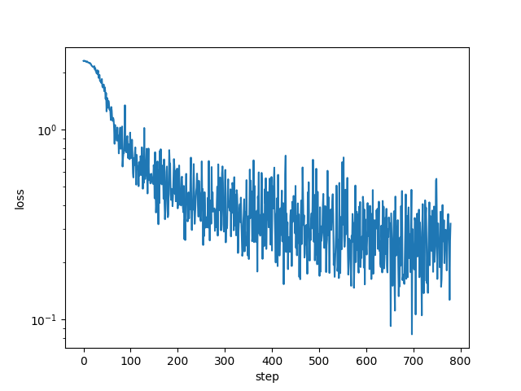
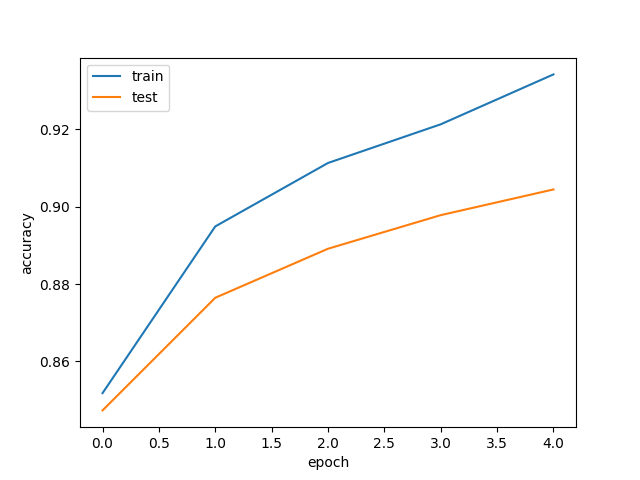

# jaxkan
JAX implementation of Kolmogorov Arnold Networks (KANs). This implementation is just for learning KANs.
The original implementation of KANs in PyTorch is [here](https://github.com/KindXiaoming/pykan). More efficient implementation of KANs in PyTorch is [here](https://github.com/Blealtan/efficient-kan)

# TODO
- [x] Support for Adam optimizer
- [ ] Support for update grid size
- [x] more efficient implementation

# How to use

## Train MNIST with KANs

```bash
$ rye run python3 src/jaxkan/train_mnist.py
param_size 64320
data loaded
input_range 0.0 1.0
epoch 0 loss: 0.416 train_accuracy: 0.852 test_accuracy: 0.847
epoch 1 loss: 0.373 train_accuracy: 0.895 test_accuracy: 0.876
epoch 2 loss: 0.315 train_accuracy: 0.911 test_accuracy: 0.889
epoch 3 loss: 0.331 train_accuracy: 0.921 test_accuracy: 0.898
epoch 4 loss: 0.320 train_accuracy: 0.934 test_accuracy: 0.904
...
```
## Loss dynamics

## Accuracy dynamics


# References
- [KAN: Kolmogorov-Arnold Networks](https://arxiv.org/abs/2404.19756)
