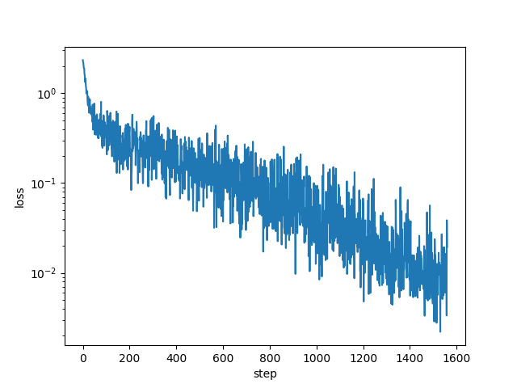
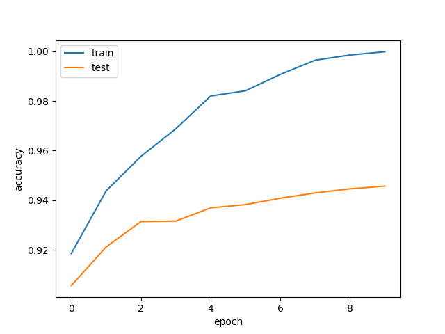
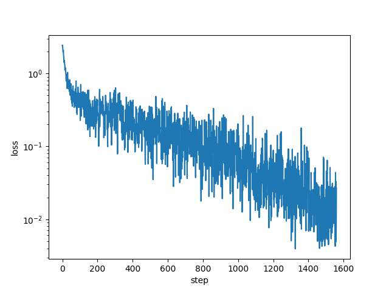
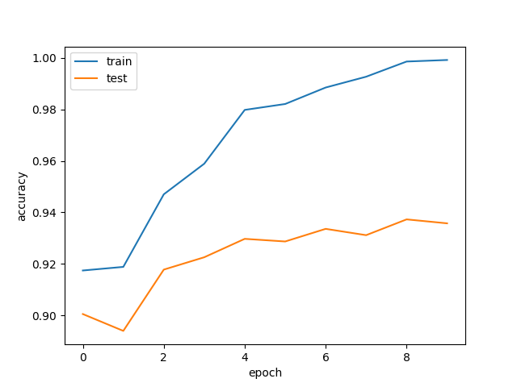

# jaxkan
JAX implementation of Kolmogorov Arnold Networks (KANs). This implementation is just for learning KANs.
The original implementation of KANs in PyTorch is [here](https://github.com/KindXiaoming/pykan). More efficient implementation of KANs in PyTorch is [here](https://github.com/Blealtan/efficient-kan)

# TODO
- [x] Support for Adam optimizer
- [x] Support for fourier basis spline
- [ ] Support for update grid size
- [x] more efficient implementation

# How to use

## Training KANs on MNIST dataset

```bash
$ rye run python3 src/jaxkan/train_mnist.py
```
## Loss dynamics

## Accuracy dynamics


## Loss dynamics with fourier basis

## Accuracy dynamics with fourier basis


# References
- [KAN: Kolmogorov-Arnold Networks](https://arxiv.org/abs/2404.19756)
