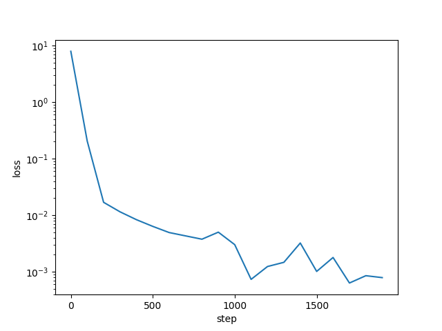

# jaxkan
JAX implementation of Kolmogorov Arnold Networks (KANs). This implementation is just for learning KANs.
The original implementation of KANs in PyTorch is [here](https://github.com/KindXiaoming/pykan). More efficient implementation of KANs in PyTorch is [here](https://github.com/Blealtan/efficient-kan)

# TODO
- [ ] Support for Adam optimizer
- [ ] Support for update grid size
- [ ] more efficient implementation (Too slow now)

# How to use


```
$ rye run python3 src/jaxkan/model.py
(step 0) loss: 7.90261697769165
(step 100) loss: 0.3270284831523895
(step 200) loss: 0.15236228704452515
(step 300) loss: 0.091661736369133
...
```

Trained toy datasets generated by $f(x_0,x_1) := \exp{(\sin{(\pi * x_0}) + x_1^2)}$ using a [2,5,1] KAN.




# References
- [KAN: Kolmogorov-Arnold Networks](https://arxiv.org/abs/2404.19756)
